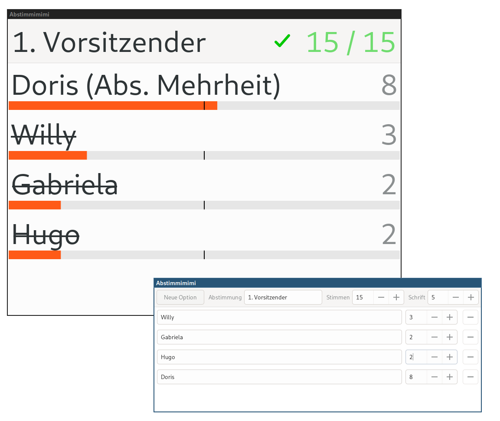

# abstimmimimi

Abstimmimimi is an applicaton for transparently counting votes at the 
general meetings at Selfnet e.V. It replaced manual tallies done in 
text editors. Since the election supervisors read out each vote before 
entering it and all members can see the results as they're updated 
there's no chance for the application to manipulate votes.

## How to build

Dependencies:

 - gtkmm3 (development files)
 - meson
 - C++20 compiler

```
meson setup build
meson compile -C build
```

## How to use

Start it: `build/abstimmimimi`. Put the results window on the projector and the entry window on the presenter's screen.
Prefix invalid votes with a hash (`#`).

